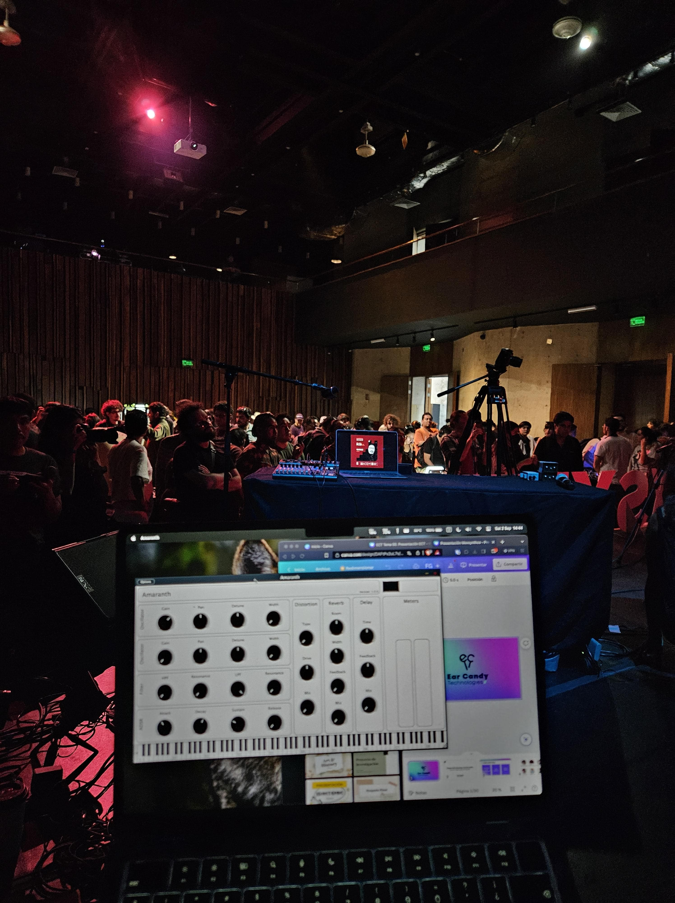
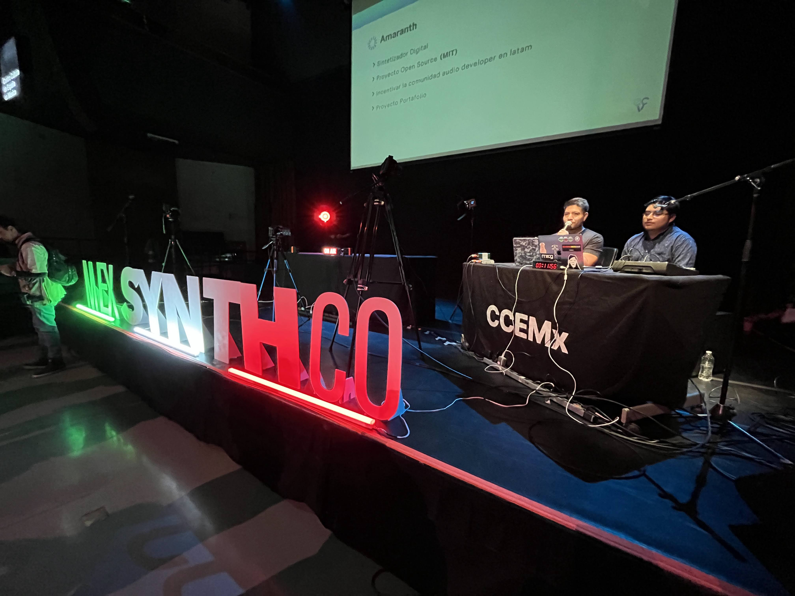

---
title: "IPN Expoacustica"
draft: false

showDate : false
showDateUpdated : false
showHeadingAnchors : false
showPagination : false
showReadingTime : false
showTableOfContents : true
showTaxonomies : false 
showWordCount : false
showSummary : false
sharingLinks : false
showEdit: false
showViews: false
showLikes: false
showAuthor: true
layoutBackgroundHeaderSpace: false
---
## Mexsynthco 2023

During September 2023, I participated with [Ear Candy Technologies](https://www.earcandytech.com) in [mexsynthco](https://mexsynthco.com/)'s open mic.

We presented **Amaranth**, an open source synth, presented about the project and invite attendees to participate.



### Gallery

  
  
  
  
  
  
  
  
  
