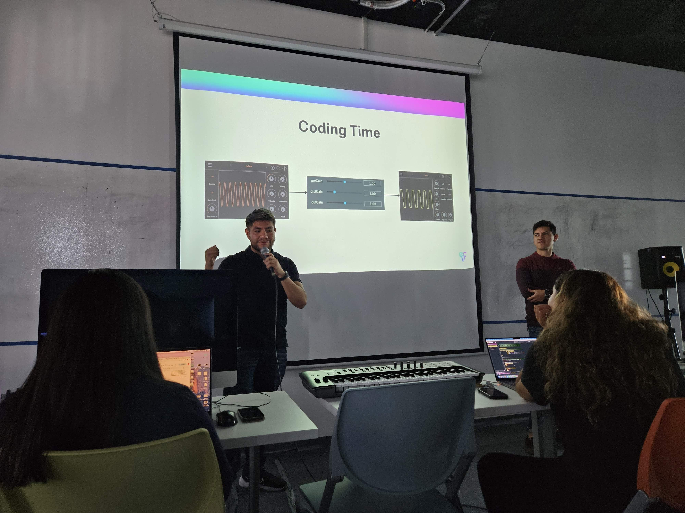
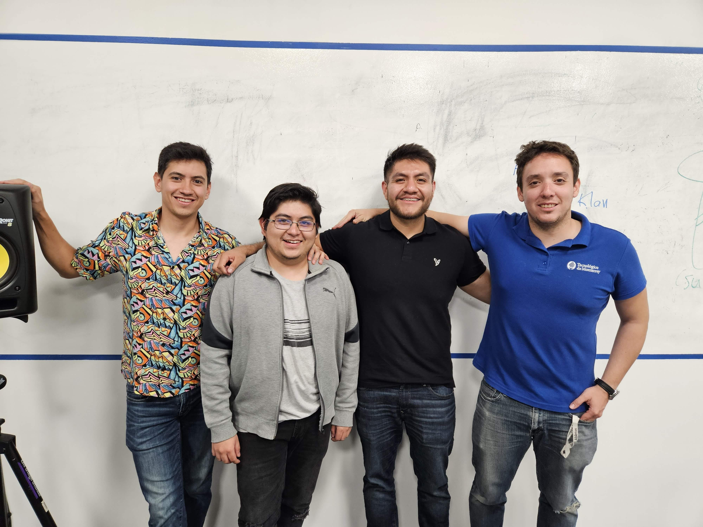
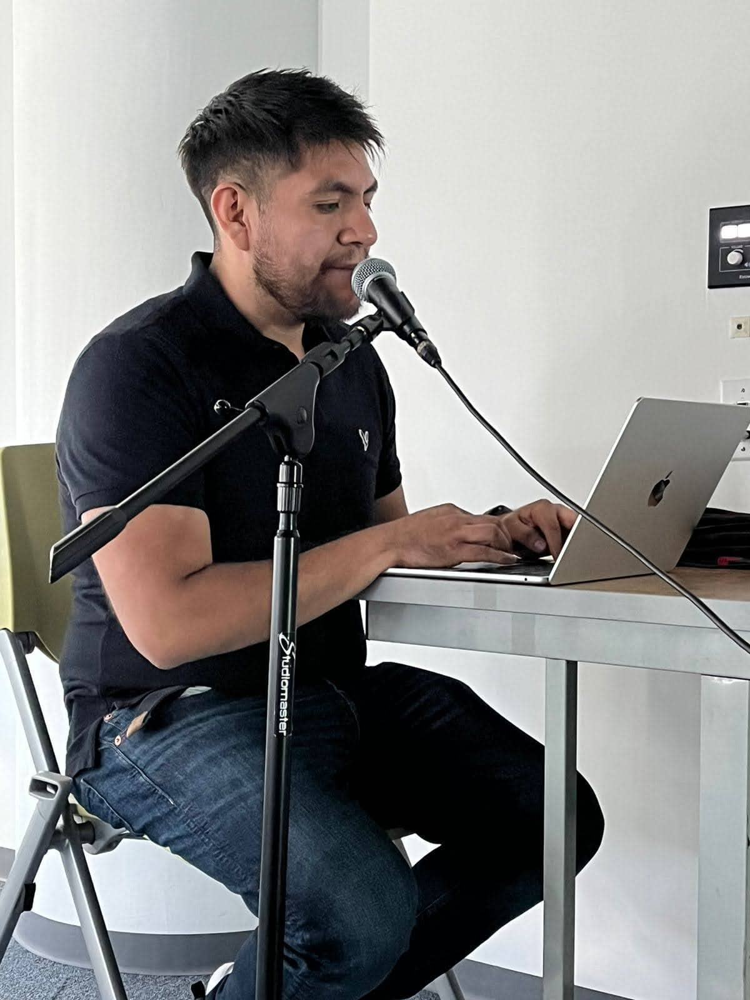
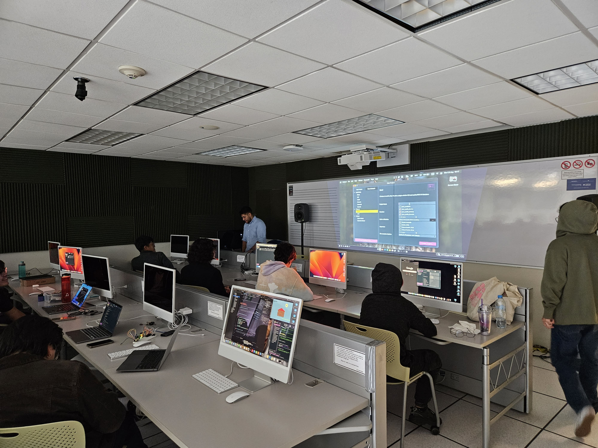
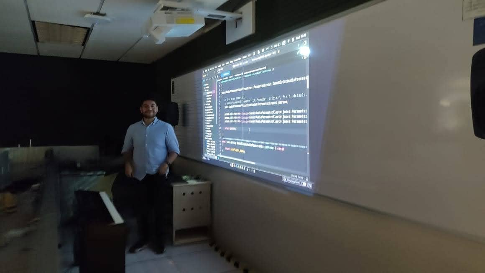
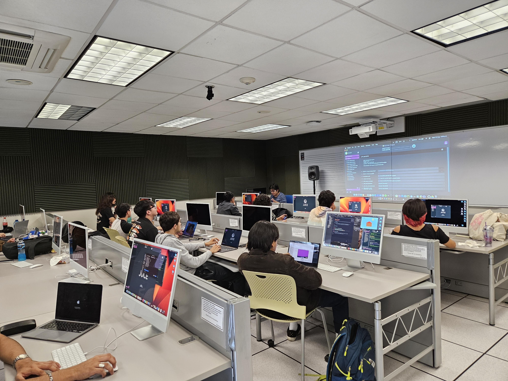

---
title: "Socios Formadores ECT"
draft: false

showDate : false
showDateUpdated : false
showHeadingAnchors : false
showPagination : false
showReadingTime : false
showTableOfContents : true
showTaxonomies : false 
showWordCount : false
showSummary : false
sharingLinks : false
showEdit: false
showViews: false
showLikes: false
showAuthor: true
layoutBackgroundHeaderSpace: false
---
## "Socios Formadores" program at Tecnológico de Monterrey

During August 2023, I participated with [Ear Candy Technologies](https://www.earcandytech.com) in a set of workshops with JUCE for the program **Socios Formadores** at Technológico de Monterrey, campus Mexico City and Puebla.







  
  
  





  
  
  




